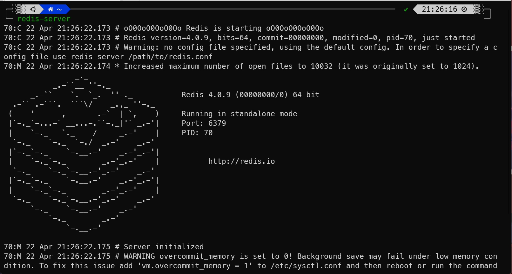
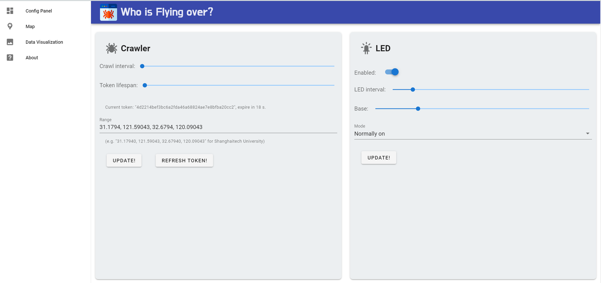

# SI100B Project: Who is Flying over?

Welcome to the python programming project for SI 100B. In this project, you are going to build a web crawler that runs on a Raspberry Pi (a mini-computer) to obtain real-time flight data from a website called FlightRadar24 (or an alternative called FlightAware). You are going to control LED lights on an external circuit through the GPIO interface of your Raspberry Pi according to different scenarios and visualize your data analysis through graphs or a website. To be specific, you will build:

1. A crawler to get data from a flight information website;

2. A module that controls LED lights on an external circuit;

3. A module or a website that accepts input parameters to your crawler;

4. A module for analyzing and visualizing your data through plain graphs or a website.

All your programs run on a Raspberry Pi.

## Overview

The project contains four parts. Each part requires you to implement a particular functionality of the project. Generally, you have one week of time to finish one part. At the end of each week, you are required to submit your implementation (Python code), a report on how you implement this part. Also, a face-to-face check will be arranged, requiring you to explain how your implementation works to a TA.

The 4 parts are:

- **[Part 1](./docs/README.part1.md)**: Build your web crawler [[report]](report/Team_GG_week1.md)
- **[Part 2](./docs/README.part2.md)**: Control the LEDs via GPIO [[report]](https://github.com/boynextdoor-cze/SI100B-Project/blob/main/report/week2.md)
- **[Part 3](./docs/README.part3.md)**: Build control panel [[report]](https://github.com/boynextdoor-cze/SI100B-Project/blob/main/report/week3.md)
- **[Part 4](./docs/README.part4.md)**: Perform data visualization [[report]](https://github.com/boynextdoor-cze/SI100B-Project/blob/main/report/week4.md)

## How to run the Project?

### Install dependencies

  ```
  pip3 install -r requirements.txt
  ```

  Additionally, make sure that `Redis` is already installed on your computer. If so, run

  ```
  redis-server
  ```

  on your PC to start the Redis server for all the communications in this project.

  If normal, the output in the terminal should be like this:

  

### Launch the program

In terminal run

  ```
  python main.py --web
  ```

  or

  ```
  python3 main.py --web
  ```

  to launch the project program.

### Open the webpage

If the response of the server is normal, enter `localhost:8999` in the browser address bar, then you can see a beautifully rendered webpage like this:



### Retrieve data by yourself

You can change the arguments in the interactive interface, and see the visualized results in the `Map` bar and `Data Visualization` bar.
