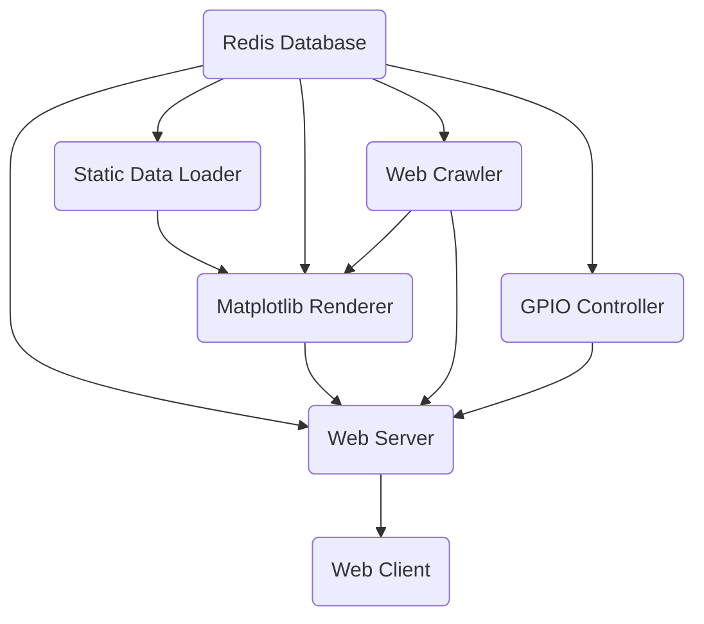

```mermaid
graph TD
	A(Redis Database) --> B(Static Data Loader)
	B --> C(Matplotlib Renderer)
	A --> C
	A --> D(Web Crawler)
	D --> C
	A --> E(Web Server)
	C --> E
	D --> E
	A --> F(GPIO Controller)
	F --> E
	E --> G(Web Client)
```