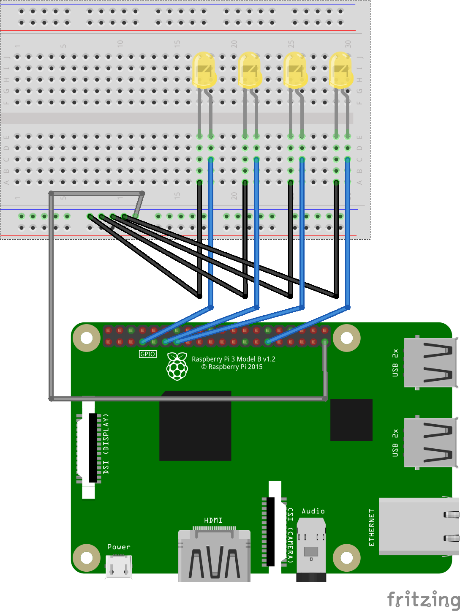

# Project Report - Week 2

# SI100B Project Report - GPIO

> Please submit this report as a PDF file along with your code to receive full score of the project. 

## Workload Division

> - Fill in the names and email addresses of your group members and describe how you divide works among team members;

| Name   | Email Address                  | Responsible for             |
| ------ | ------------------------------ | --------------------------- |
| 彭程   | pengcheng2@shanghaitech.edu.cn | integrating LED controller  |
| 迟择恩 | chize@shanghaitech.edu.cn      | circuit designing           |
| 刘翊航 | liuyh10@shanghaitech.edu.cn    | low-level light controlling |

## Preliminary Comment

> - Please cite any online or offline resources you consulted in this project;
> - Please describe the difficulties you encountered in this project;

- [tutorial plus - electronics](https://computers.tutsplus.com/tutorials/how-to-use-a-breadboard-and-build-a-led-circuit--mac
  -54746) how to use a breadboard in a simple LED array circuit
- [gpiozero offcial document](https://gpiozero.readthedocs.io/en/stable/recipes.html) for GPIO API usage and circuit design.
- [github: redis.py](https://github.com/andymccurdy/redis-py) redis client in python.
- [arch wiki: redis](https://wiki.archlinux.org/index.php/Redis) installing redis and redis deamon controlling.
- [runoob: installing redis on docker](https://www.runoob.com/docker/docker-install-redis.html)
- [fritzing offcial tutorialw](https://fritzing.org/learning/tutorials/building-circuit)


~~I should admit that we didn't encounter much difficulties in this week. `gpiozero` and `redis.py` has clear documentation. And the circuit isn't a complicated one~~

1. `gpio name`,`physicis pin number`,`BCM pin number`  differ from each other, a bit confusing. Workaround:  `LED("BCM4"),LED("GPIO7")`
2. circuit designing: avoid short circuit. (on breadboard). Solution: use `Fritzing` to examine  whether `GND` and `+3.3V` pin are directly connected.
3. Wiring: how to make it clean and intuitive.

​	

## Control the LED

> - Describe how you connect the LED to your Pi. You could answer this question with a diagram of your system;
> - What functions or classes did you use to control the LED? How did you determine which LED to control in you code when multiple LEDs were presented in the system?

### part1 circuit diagram(by fritzing)




### part2 LED controlling

We used `gpiozero.PWMLED` class, create a led object by `led = gpiozero.PWMLED(17)`, and `PWMLED.blink(on_time,off_time),PWMLED.value=x` to control the led.

We store the `PWMLED` objects corresponding to each LED in a list. Determine the led by list subscript.
For example if we have three led whose positive pin(the longer pin) are `pin0,pin1,pin2`  we can use `led[0]` to control the first LED after initializing with `led=[PWMLED(pin0),PWMLED(pin1),PWMLED(pin2)]`.

Finally, we implement the `LightController` class enclosing the led manipulations e.g. `LightController.work_once(output :List[float],mode: int)` which scan the list find all the non-zero positions and light up the corresponding LEDs (for mode: `0` simply lights up the LED `led.value=output` while `1` makes the led twinkle).

## Integration with the Crawler

> - What did you implement in `state.py` so that the behavior of the class could be observed when running `state.py` directly while importing anything from the file would not cause the demo to be run?

We implement the functionality in `State.spin` and this line at the end of the file.

```python
if __name__=='__main__': State().spin()
```

When the code is loaded by the interpreter, everything will be executed, and there is no `main()` function in python. Fortunately we have a special variable`__name__`  which indicates the name of this module.
When we import the module by `import state` and `state.py` is loaded, `__name__` in `state.py` will be replaced by `state`(the module name). 
When we directly run the code using `python state.py`, `__name__` in `state.py` will be `__main__`


Thus this line of code will be executed only when directly run `state.py`.

